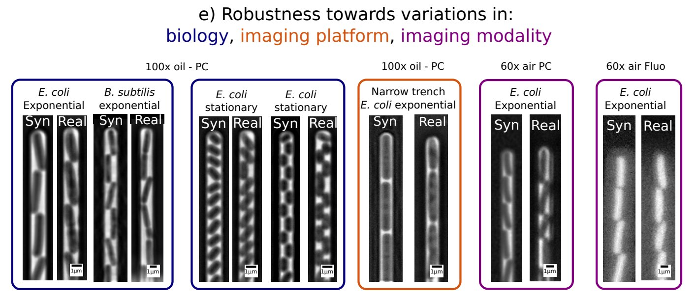
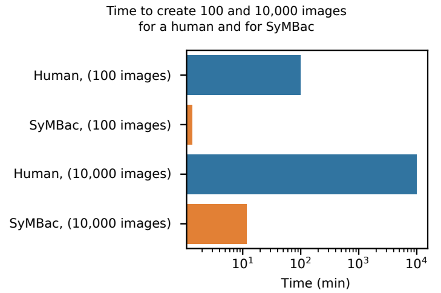
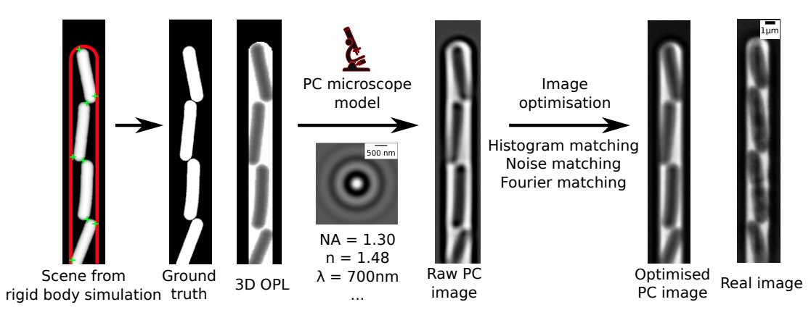

# SyMBac: Synthetic Micrographs of Bacteria

[Read the preprint: Accurate Segmentation of Bacterial Cells using Synthetic Training Data](https://doi.org/10.1101/2021.07.21.453284)

[Georgeos Hardo, Maximillian Noka, Somenath Bakshi](https://doi.org/10.1101/2021.07.21.453284)

doi: https://doi.org/10.1101/2021.07.21.453284


## What is it?

SyMBac is a tool to generate synthetic phase contrast or fluorescence images of bacteria. Currently the tool only supports bacteria growing in the mother machine, however support for bacteria growing in monolayers (and maybe even biofilms!) is coming. 




## Why would I want to generate synthetic images?

Because you're sick of generating your own training data by hand! Synthetic images provide an instant source of high quality and unlimited training data for machine learning image segmentation algorithms! 

The images are tuned to perfectly replicate your experimental setup, no matter what your microscope's objective is (we have tested 20x air all the way to 100x oil), no matter your imaging modality (phase contrast/fluorescence), and no matter the geometry of your microfluidic device. 

Additionally,

* SyMBac is very fast compared to humans:



* The image generation process uses a rigid body physics model to simulate bacterial growth, 3D cell geometry to calculate the light's optical path, and a model of the phase contrast/fluorescence optics (point spread function), with some post-rendering optimisation to match image similarity:



## How do I use these synthetic images?

That is up to you. SyMBac is **not** a machine learning tool. It is a tool to generate unlimited free training data which accurately represents your experiment. It is up to you to train a machine learning network on these synthetic images. We do however provide example notebooks for how to train a U-net (as implemented by [DeLTA](https://journals.plos.org/ploscompbiol/article?id=10.1371/journal.pcbi.1007673)).

 

## Prerequisites

Please make sure you have an NVIDIA GPU and a working installation of `CUDA` and `cudNN`. If you don't have an NVIDIA GPU then the convolution will default to the CPU, and be **very** slow.

SyMBac is meant to be run *interactively* (in a notebook + with a small Qt/GTK interface), so make sure that you are running this on a local machine (you should have access to the machine's display).

## Installation

```sh
pip install SyMBac
```

Activate the Jupyter widgets extension. This is needed to interact with slides in the notebooks to optimise images. 

```sh
jupyter nbextension enable --py widgetsnbextension
```

### If you're using a GPU:

Check the version of `CUDA` you have installed using `nvcc --version` and install the appropriate version of [cupy](https://cupy.dev/). For example, if you have `CUDA 11.4` you would install as follows:

```sh
pip install cupy-cuda114
```

## Usage

Download the [drawing example notebook](examples/Drawing_Phase_Contrast_100x_oil.ipynb) and follow along! 