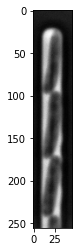

SyMBac Example Notebook 1
=========================

Drawing 100x images of *E. coli* in the mother machine

Imports
~~~~~~~

.. code:: ipython3

    from joblib import Parallel, delayed
    from matplotlib import pyplot as plt
    
    
    from SyMBac.PSF import get_phase_contrast_kernel, get_condensers
    from SyMBac.misc import get_sample_images
    from SyMBac.general_drawing import generate_curve_props, gen_cell_props_for_draw, get_space_size, convolve_rescale, \
        make_images_same_shape
    
    import napari
    
    import numpy as np
    from ipywidgets import interactive, fixed
    from tqdm.notebook import tqdm
    
    import importlib
    
    from SyMBac.phase_contrast_drawing import run_simulation, get_trench_segments, draw_scene, generate_PC_OPL, \
        generate_test_comparison, generate_training_data
    
    if importlib.util.find_spec("cupy") is None:
        manual_update = True
    else:
        manual_update = False

.. parsed-literal::

    /home/georgeos/miniconda3/envs/symbac/lib/python3.9/site-packages/SyMBac/general_drawing.py:18: UserWarning: Could not load CuPy for SyMBac, are you using a GPU? Defaulting to CPU convolution.
      warnings.warn("Could not load CuPy for SyMBac, are you using a GPU? Defaulting to CPU convolution.")

Load a real image
-----------------

-  Make sure this image is somewhat representative of the data you want
   to simulate. The simulated data will have the same dimensions as the
   example image.
-  Also you will try to match the similarity of your synthetic images to
   this real image.

.. code:: ipython3

    real_image = get_sample_images()["E. coli 100x"]
    print(real_image.shape)
    plt.imshow(real_image,cmap="Greys_r")
    plt.show()

.. parsed-literal::

    (256, 46)

Scope properties
----------------

Here we input the scope properties: \* ``W``, ``R`` and ``diameter`` are
the dimensions (in mm) of the phase ring, retrieved from
``get_condensers()``. \* ``λ`` is the wavelength of the imaging light
(in micron). \* ``resize_amount`` is an **important** variable. This
defines the internal resolution scaling of the rendering. If you choose
a ``resize_amount`` of 3, then the point spread function (PSF) and all
cell images are rendered at 3x the native imaging resolution, then
downsampled back to the real resolution. \* A ``resize_amount`` of
:math:`>2` is recommended. If it’s too low then the PSF is too low
resolution, and therefore doesn’t capture the desired information
(oscillating phase and airy rings). \* ``pix_mic_conv`` is the size of
the pixels in the image (micron/pix) \* ``scale`` is the pixel size that
the PSF and all rendering will be done at, therefore it’s set to
``pix_mic_conv / resize_amount`` by default. \* ``min_sigma`` is a lower
bound for the gaussian apodisation of the PSF. This variable isn’t
really important as you’ll change it with the sliders at the end. \*
``NA`` is the numerical aperture of the objective lens. \* ``n`` is the
refractive index of the imaging medium

These parameters are then thrown into a ``kernel_params`` tuple.

.. code:: ipython3

    condensers = get_condensers()
    W, R, diameter = condensers["Ph3"]
    radius=50
    #F = 5
    λ = 0.75
    resize_amount = 3
    pix_mic_conv = 0.0655 ##0.108379937 micron/pix for 60x, 0.0655 for 100x
    scale = pix_mic_conv / resize_amount 
    min_sigma = 0.42*0.6/6 / scale # micron#
    sigma=min_sigma
    NA=1.45
    n = 1.4
    kernel_params = (R,W,radius,scale,NA,n,sigma,λ)
    
    #kernel_params = (R,W,radius,scale,F,sigma,λ)

Run the simulation
------------------

Here we actually run the simulation of cell growth in the mother
machine.

-  ``sim_length`` is the number of simulation frames to run.
-  ``trench_length`` is the length of the mother machine trench in
   micron.
-  ``trench_width`` is the width of the mother machine trench in micron.
-  ``cell_max_length`` is the mean maximum length of a cell in micron.
-  ``cell_width`` is the mean cell width in micron.
-  ``gravity`` is a parameter which can be used to add or remove
   pressure of cells on one another. This is useful if for some reason
   cells in your simulation are falling into each other (although you
   should change ``phys_iters`` first if this is happening).
-  ``phys_iters`` is the number of physics iterations per frame. 20 is a
   good starting point.
-  ``max_length_var`` is the variance of the mean maximum cell length.
   Don’t make it too high, or some cells could have birth lengths
   greater than the mother length, or negative lengths.
-  ``width_var`` is the variance of the mean cell width
-  ``save_dir`` is the directory to save the simulation output if you
   want to analyse it later, or with other code.
-  ``do_transformation`` is a ``bool`` that decides whether cells are
   given a curve after the simulation, during rendering.

If you don’t like the way the simulation looks **restart the kernel**
and try new parameters. I’ve found that for large deviations in cell
length and width, and small deviations in trench length and width, a
standard U-net implementation is very robust, so you really only need to
guess these paramters for good training data.

.. code:: ipython3

    sim_length = 150
    cell_timeseries, space = run_simulation(
        trench_length=15, 
        trench_width=1.5, 
        cell_max_length=6, #6, long cells # 1.65 short cells
        cell_width= 1, #1 long cells # 0.95 short cells
        sim_length = sim_length,
        pix_mic_conv = pix_mic_conv,
        gravity=0,
        phys_iters=20,
        max_length_var = 3,
        width_var = 0.3,
        save_dir="/tmp/"
    ) # growth phase
    main_segments = get_trench_segments(space)
    ID_props = generate_curve_props(cell_timeseries)
    cell_timeseries_properties = Parallel(n_jobs=-1)(
        delayed(gen_cell_props_for_draw)(a, ID_props) for a in tqdm(cell_timeseries, desc='Timeseries Properties'))
    do_transformation = True
    offset = 30
    label_masks = True
    space_size = get_space_size(cell_timeseries_properties)
    scenes = Parallel(n_jobs=13)(delayed(draw_scene)(
        cell_properties, do_transformation, space_size, offset, label_masks) for cell_properties in tqdm(cell_timeseries_properties, desc='Scene Draw:'))

.. parsed-literal::

    Timeseries Properties:   0%|          | 0/148 [00:00<?, ?it/s]

.. parsed-literal::

    /home/georgeos/miniconda3/envs/symbac/lib/python3.9/site-packages/SyMBac/general_drawing.py:18: UserWarning: Could not load CuPy for SyMBac, are you using a GPU? Defaulting to CPU convolution.
      warnings.warn("Could not load CuPy for SyMBac, are you using a GPU? Defaulting to CPU convolution.")
    /home/georgeos/miniconda3/envs/symbac/lib/python3.9/site-packages/SyMBac/general_drawing.py:18: UserWarning: Could not load CuPy for SyMBac, are you using a GPU? Defaulting to CPU convolution.
      warnings.warn("Could not load CuPy for SyMBac, are you using a GPU? Defaulting to CPU convolution.")
    /home/georgeos/miniconda3/envs/symbac/lib/python3.9/site-packages/SyMBac/general_drawing.py:18: UserWarning: Could not load CuPy for SyMBac, are you using a GPU? Defaulting to CPU convolution.
      warnings.warn("Could not load CuPy for SyMBac, are you using a GPU? Defaulting to CPU convolution.")
    /home/georgeos/miniconda3/envs/symbac/lib/python3.9/site-packages/SyMBac/general_drawing.py:18: UserWarning: Could not load CuPy for SyMBac, are you using a GPU? Defaulting to CPU convolution.
      warnings.warn("Could not load CuPy for SyMBac, are you using a GPU? Defaulting to CPU convolution.")
    /home/georgeos/miniconda3/envs/symbac/lib/python3.9/site-packages/SyMBac/general_drawing.py:18: UserWarning: Could not load CuPy for SyMBac, are you using a GPU? Defaulting to CPU convolution.
      warnings.warn("Could not load CuPy for SyMBac, are you using a GPU? Defaulting to CPU convolution.")
    /home/georgeos/miniconda3/envs/symbac/lib/python3.9/site-packages/SyMBac/general_drawing.py:18: UserWarning: Could not load CuPy for SyMBac, are you using a GPU? Defaulting to CPU convolution.
      warnings.warn("Could not load CuPy for SyMBac, are you using a GPU? Defaulting to CPU convolution.")
    /home/georgeos/miniconda3/envs/symbac/lib/python3.9/site-packages/SyMBac/general_drawing.py:18: UserWarning: Could not load CuPy for SyMBac, are you using a GPU? Defaulting to CPU convolution.
      warnings.warn("Could not load CuPy for SyMBac, are you using a GPU? Defaulting to CPU convolution.")
    /home/georgeos/miniconda3/envs/symbac/lib/python3.9/site-packages/SyMBac/general_drawing.py:18: UserWarning: Could not load CuPy for SyMBac, are you using a GPU? Defaulting to CPU convolution.
      warnings.warn("Could not load CuPy for SyMBac, are you using a GPU? Defaulting to CPU convolution.")
    /home/georgeos/miniconda3/envs/symbac/lib/python3.9/site-packages/SyMBac/general_drawing.py:18: UserWarning: Could not load CuPy for SyMBac, are you using a GPU? Defaulting to CPU convolution.
      warnings.warn("Could not load CuPy for SyMBac, are you using a GPU? Defaulting to CPU convolution.")
    /home/georgeos/miniconda3/envs/symbac/lib/python3.9/site-packages/SyMBac/general_drawing.py:18: UserWarning: Could not load CuPy for SyMBac, are you using a GPU? Defaulting to CPU convolution.
      warnings.warn("Could not load CuPy for SyMBac, are you using a GPU? Defaulting to CPU convolution.")
    /home/georgeos/miniconda3/envs/symbac/lib/python3.9/site-packages/SyMBac/general_drawing.py:18: UserWarning: Could not load CuPy for SyMBac, are you using a GPU? Defaulting to CPU convolution.
      warnings.warn("Could not load CuPy for SyMBac, are you using a GPU? Defaulting to CPU convolution.")
    /home/georgeos/miniconda3/envs/symbac/lib/python3.9/site-packages/SyMBac/general_drawing.py:18: UserWarning: Could not load CuPy for SyMBac, are you using a GPU? Defaulting to CPU convolution.
      warnings.warn("Could not load CuPy for SyMBac, are you using a GPU? Defaulting to CPU convolution.")
    /home/georgeos/miniconda3/envs/symbac/lib/python3.9/site-packages/SyMBac/general_drawing.py:18: UserWarning: Could not load CuPy for SyMBac, are you using a GPU? Defaulting to CPU convolution.
      warnings.warn("Could not load CuPy for SyMBac, are you using a GPU? Defaulting to CPU convolution.")
    /home/georgeos/miniconda3/envs/symbac/lib/python3.9/site-packages/SyMBac/general_drawing.py:18: UserWarning: Could not load CuPy for SyMBac, are you using a GPU? Defaulting to CPU convolution.
      warnings.warn("Could not load CuPy for SyMBac, are you using a GPU? Defaulting to CPU convolution.")
    /home/georgeos/miniconda3/envs/symbac/lib/python3.9/site-packages/SyMBac/general_drawing.py:18: UserWarning: Could not load CuPy for SyMBac, are you using a GPU? Defaulting to CPU convolution.
      warnings.warn("Could not load CuPy for SyMBac, are you using a GPU? Defaulting to CPU convolution.")
    /home/georgeos/miniconda3/envs/symbac/lib/python3.9/site-packages/SyMBac/general_drawing.py:18: UserWarning: Could not load CuPy for SyMBac, are you using a GPU? Defaulting to CPU convolution.
      warnings.warn("Could not load CuPy for SyMBac, are you using a GPU? Defaulting to CPU convolution.")

.. parsed-literal::

    Scene Draw::   0%|          | 0/148 [00:00<?, ?it/s]

Generating a sample
~~~~~~~~~~~~~~~~~~~

Here we generate some dummy samples which are later used.

.. code:: ipython3

    # plt.imshow(temp_expanded_scene)
    
    
    media_multiplier=30
    cell_multiplier=1
    device_multiplier=-50
    y_border_expansion_coefficient = 2
    x_border_expansion_coefficient = 2
    
    
    
    temp_expanded_scene, temp_expanded_scene_no_cells, temp_expanded_mask = generate_PC_OPL(
       main_segments=main_segments,
        offset=offset,
        scene = scenes[0][0],
        mask = scenes[0][1],
        media_multiplier=media_multiplier,
        cell_multiplier=cell_multiplier,
        device_multiplier=cell_multiplier,
        y_border_expansion_coefficient = y_border_expansion_coefficient,
        x_border_expansion_coefficient = x_border_expansion_coefficient,
        fluorescence=False,
        defocus=30
    )
    
    
    
    ### Generate temporary image to make same shape
    temp_kernel = get_phase_contrast_kernel(*kernel_params)
    convolved = convolve_rescale(temp_expanded_scene, temp_kernel, 1/resize_amount, rescale_int = True)
    real_resize, expanded_resized = make_images_same_shape(real_image,convolved, rescale_int=True)

.. parsed-literal::

    /home/georgeos/miniconda3/envs/symbac/lib/python3.9/site-packages/SyMBac/PSF.py:88: RuntimeWarning: invalid value encountered in divide
      kernel1 = 2*jv(1,rr)/(rr)
    /home/georgeos/miniconda3/envs/symbac/lib/python3.9/site-packages/SyMBac/PSF.py:91: RuntimeWarning: invalid value encountered in divide
      kernel2 = 2*(R-W)**2/R**2 * jv(1,(R-W)**2/R**2 * rr)/rr

Choosing intensities using Napari
---------------------------------

The following cell will open a Napari window where you will select
intensities.

-  Select hte media/cell/device layer, and use the brush tool to paint
   over some (or all) of the mother machine device, media (area between
   cells) and the cells.
-  You can use the same label colour (``1``) for all of them, they are
   in different layers so it doesn’t matter if they touch.
-  We do this because we want to find the 3 main intensities of the real
   image, the media, device and the cells. We then use these to estimate
   the similarity between the synthetic images and the real images.

.. code:: ipython3

    viewer = napari.view_image(real_resize)
    media_label = viewer.add_labels(np.zeros(real_resize.shape).astype(int), name = "media")
    cell_label = viewer.add_labels(np.zeros(real_resize.shape).astype(int), name = "cell")
    device_label = viewer.add_labels(np.zeros(real_resize.shape).astype(int), name = "device")

.. code:: ipython3

    real_media_mean = real_resize[np.where(media_label.data)].mean()
    real_cell_mean = real_resize[np.where(cell_label.data)].mean()
    real_device_mean = real_resize[np.where(device_label.data)].mean()
    real_means = np.array((real_media_mean, real_cell_mean, real_device_mean))
    
    real_media_var = real_resize[np.where(media_label.data)].var()
    real_cell_var = real_resize[np.where(cell_label.data)].var()
    real_device_var = real_resize[np.where(device_label.data)].var()
    real_vars = np.array((real_media_var, real_cell_var, real_device_var))
    
    image_params = (real_media_mean, real_cell_mean, real_device_mean, real_means, real_media_var, real_cell_var, real_device_var, real_vars)

.. code:: ipython3

    mean_error = []
    media_error = []
    cell_error = []
    device_error = []
    
    mean_var_error = []
    media_var_error = []
    cell_var_error = []
    device_var_error = []
    
    error_params = (mean_error,media_error,cell_error,device_error,mean_var_error,media_var_error,cell_var_error,device_var_error)
    
    params = interactive(
        generate_test_comparison,
        {'manual': manual_update},
        media_multiplier=(-300,300,1),
        cell_multiplier=(-30,30,0.01),
        device_multiplier=(-300,300,1),
        sigma=(min_sigma,min_sigma*20, min_sigma/20),
        scene_no = (0,len(scenes)-1,1),
        noise_var=(0,0.01, 0.0001),
        scale=fixed(scale),
        match_fourier = [True, False],
        match_histogram = [True, False],
        match_noise = [True, False],
        offset=fixed(offset),
        main_segments = fixed(main_segments),
        debug_plot=fixed(True),
        scenes = fixed(scenes),
        kernel_params = fixed(kernel_params),
        resize_amount = fixed(resize_amount), 
        real_image = fixed(real_image),
        image_params = fixed(image_params),
        error_params = fixed(error_params),
        x_border_expansion_coefficient = fixed(x_border_expansion_coefficient),
        y_border_expansion_coefficient = fixed(y_border_expansion_coefficient),
        fluorescence=[False, True],
        defocus=(0,20,0.1)
    );

Manual image optimisation
-------------------------

The image optimisation landscape is extremely noisy, and so I have not
been able to find an objective function and optimiser which reliably
converge and produce good images. Instead I’ve found that quickly
playing with sliders is a very good way of getting the images to look
correct.

-  ``media_multiplier`` is the intensity multiplier for the media part
   of the image
-  ``cell_multiplier`` is the intensity multiplier for cell parts of the
   image.
-  ``device_multiplier`` is the intensity multiplier for the device part
   of the image.
-  ``sigma`` is the radius (in pixels) of the gaussian apodisation of
   the phase contrast PSF (if you are using phase contrast).
-  ``scene_no`` is the index for the frame of the synthetic images you
   rendered.
-  ``match_fourier`` controls whether you are matching the rotational
   Fourier spectrum of the synthetic image to the real image.
-  ``match_histogram`` controls whether you are matching the intensity
   histogram of the images with each other.
-  ``match_noise`` controls whether you are matching the camera noise of
   the images with each other.
-  ``noise_var`` controls the variance of the shot noise added to the
   image.
-  ``fluorescence`` controls whether you are rendering a fluorescence of
   phase contrast image.
-  ``defocus`` controls the radius of a gaussian which simulates depth
   of focus and out of focus effects of the PSF.

.. code:: ipython3

    params

.. parsed-literal::

    interactive(children=(IntSlider(value=75, description='media_multiplier', max=300, min=-300), FloatSlider(valu…

.. code:: ipython3

    generate_training_data(interactive_output = params, sample_amount = 0.05, randomise_hist_match = False, randomise_noise_match = True, sim_length = sim_length, burn_in = 0, n_samples =  1000, save_dir = "/tmp/")

.. parsed-literal::

    Sample generation:  86%|████████▌ | 856/1000 [01:20<00:13, 10.35it/s]

