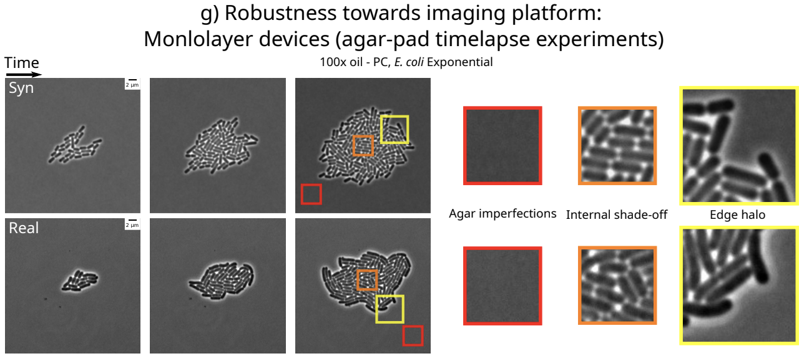

SyMBac Documentation
====================

SyMBac (Synthetic Micrographs of Bacteria) is a tool to generate synthetic phase contrast or fluorescence images of bacteria. Currently the tool only supports bacteria growing in the mother machine, however support for bacteria growing in monolayers (and maybe even biofilms!) is coming. 

Read the preprint_, SyMBac: Synthetic Micrographs for Accurate Segmentation of Bacterial Cells using Deep Neural Networks, Georgeos Hardo, Maximillian Noka, Somenath Bakshi

.. note::

   This project is under active development. Please report issues on GitHub, or if you want specific usage help, please email_ me.

**What is it?**

SyMBac is a tool to generate synthetic phase contrast or fluorescence images of bacteria. Currently the tool only supports bacteria growing in the mother machine, we also have preliminary support for bacteria growing in 2D monolayers on agar pads (again, both in fluorescence and phase contrast).

.. image:: images/index/paper_figures/syn_mother_machine.png
   :align: center
   :width: 1000px

.. image:: images/index/paper_figures/syn_turbedostat.png
   :align: center
   :width: 1000px

**Why would I want to generate synthetic images?**

Because you're sick of generating your own training data by hand! Synthetic images provide an instant source of high quality and unlimited training data for machine learning image segmentation algorithms!

The images are tuned to perfectly replicate your experimental setup, no matter what your microscope's objective is (we have tested 20x air all the way to 100x oil), no matter your imaging modality (phase contrast/fluorescence), and no matter the geometry of your microfluidic device.

Additionally:

- SyMBac is very fast at generating training data compared to humans:
   .. image:: images/index/paper_figures/human_speed_comparison.png
    :align: left
    :width: 400px
- The image generation process uses a rigid body physics model to simulate bacterial growth, 3D cell geometry to calculate the light's optical path, and a model of the phase contrast/fluorescence optics (point spread function), with some post-rendering optimisation to match image similarity:
   .. image:: images/index/paper_figures/simulation.png  
  
**How do I use these synthetic images?**

That is up to you. SyMBac is not a machine learning tool. It is a tool to generate unlimited free training data which accurately represents your experiment. It is up to you to train a machine learning network on these synthetic images. We do however provide example notebooks for how to train a U-net (as implemented by DeLTA_), and for training Omnipose_.

.. image:: images/index/paper_figures/training.png
   :align: center
   :width: 350px

Contents
--------

.. toctree::

   usage
   api

.. _preprint: https://www.biorxiv.org/content/10.1101/2021.07.21.453284v4

.. _email: gh464@cam.ac.uk

.. _DeLTA: https://journals.plos.org/ploscompbiol/article?id=10.1371/journal.pcbi.1007673

.. _Omnipose: https://www.biorxiv.org/content/10.1101/2021.11.03.467199v4