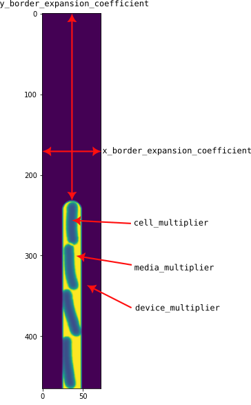

===================================
Scene generation / Scene drawing
===================================

This tutorial describes the generation of synthetic images. Please make sure you've generated some cell simulation data from the :ref:`cell_growth_simulations` part of these docs. 

The first thing we need to do is load in the important data we saved from the previous section. This includes the ``cell_timeseries_properties`` object (which defines each cell's properties in every timepoint), and the ``main_segments`` object, which defines the trench geometry.

.. code-block:: python
    :caption: Necessary imports, and loading in ``cell_timeseries_properties`` which we generated in :ref:`cell_growth_simulations`

    from SyMBac.PSF import get_condensers
    from SyMBac.general_drawing import get_space_size
    from joblib import Parallel, delayed
    from tqdm.notebook import tqdm
    from SyMBac.phase_contrast_drawing import draw_scene, generate_PC_OPL
    import pickle
    import matplotlib.pyplot as plt

    cell_timeseries_properties_file = open("cell_timeseries_properties.p", "rb")
    cell_timeseries_properties = pickle.load(cell_timeseries_properties_file)
    cell_timeseries_properties_file.close()

    main_segments_file = open("main_segments.p", "rb")
    main_segments = pickle.load(main_segments_file)
    main_segments_file.close()

The next thing we must do is define the optical parameters which define the microscope simulation. You should know what phase contrast condensor you are using, you have the choice between the 'Ph1', 'Ph2', 'Ph3', 'Ph4', and 'PhF' condensors. 

.. note::

   If you only intend to generate fluorescence images, then you can choose any condenser key you want. It will not change the simulation.

- *W, R, diameter*: The ``get_condensers()`` function returns a dictionary of condensers for which you can pick a key from the above list. This will in turn return the dimensions of the chosen condenser. 
- *radius*: The radius of the PSF convolution kernel to be generated. Must be an even number.
- *λ*: The average wavelength of the illumination light source.
- *resize_amount*: This is the "upscaling" factor for the simulation and the entire image generation process. Must be the same as the value defined in :ref:`simple_simulation`
- *pix_mic_conv*: The number of microns per pixel. Again, should be the same value as defined in :ref:`simple_simulation`. 
- *NA*: The numberical aperture of the objective lens.
- *n*: The refractive index of the imaging medium.
- *sigma* and *min_sigma*: This is the sigma parameter for a 2D Gaussian which will be multiplied by the phase contrast kernel. This simulates apodisaton within the objective lens to attenuate halo and increase contrast. *min_sigma* is a calculated theoretical smallest Gaussian which would result in maximum apodisation. In reality the achieved apodisation is far from ideal.

.. code-block:: python
    :caption: Setting up the microscope parameters for image generation

    ## Fixed parameters given by the scope and camera
    condensers = get_condensers()
    W, R, diameter = condensers["Ph3"]
    radius = 50 #I've found 50 to be the best kernel size to optimise convolution speed while maintaining accuracy
    λ = 0.75
    resize_amount = 3
    pix_mic_conv = 0.0655 #0.108379937 micron/pix for 60x, 0.0655 for 100x
    scale = pix_mic_conv / resize_amount 
    NA = 1.45
    n = 1.4

    ## Free parameters given by the undefined apodisation of the objective. 
    ## If unsure, leave this unchanged
    min_sigma = 0.42*0.6/6 / scale #micron
    sigma = min_sigma*10

    kernel_params = (R,W,radius,scale,NA,n,sigma,λ) #Put into a tuple for easy use later
    temp_kernel = get_phase_contrast_kernel(*kernel_params)
    plt.imshow(temp_kernel, cmap="Greys_r")
    plt.title("Phase contrast kernel")

..  image:: images/scene_generation/PC_PSF.png
   :width: 150px

Now we can use the ``draw_scene`` function to extract information from the simulation and redraw the cells as an image, applying transformations as necessary. We have some additional parameters which need specifying.

- *do_transformation*: Whether or not to use each cell's transformation attributes to bend or morph the cells to increase realism. 
.. warning:: 
    In extreme cases (very narrow trenches), setting this to *do_transformation* to ``True`` will cause clipping with the mother machine wall.

- *offset*: This is a parameter which ensures that cells never touch the edge of the image after being transformed. In general this can be left as is (30), but you will recieve an error if it needs increasing.
- *label_masks*: This controls whether the output training masks will be binary or labeled. Binary masks are used to train U-net, wheras labeled masks are used to train Omnipose_
- *space_size*: The size of the space used in the simulation, governing how large the image shall be. This is typically autocalculated using the ``get_space_size`` function. 

After defining these arguments, we can pass them to ``draw_scene``, which will produce a list of scenes and corresponding masks for the entire simulation. Here we run this in parallel, for increased speed.

.. code-block:: python
    :caption: Setting up scene generation parameters

    do_transformation = True
    offset = 30
    label_masks = True
    space_size = get_space_size(cell_timeseries_properties)
    
    scenes = Parallel(n_jobs=-1)(delayed(draw_scene)(
        cell_properties, do_transformation, space_size, offset, label_masks) for cell_properties in tqdm(cell_timeseries_properties, desc='Scene Draw:'))

We can visualise what a scene (right) and its corresponding masks (right) look like. You can see that it is simply drawn as cells on a 0 background, with the intensity in each pixel corresponding to the thickness of the cell at that point. The masks are just the pixels where a cell can be found.

.. code-block:: python
    :caption: Just quickly visualising what a scene looks like

    fig, (ax1, ax2) = plt.subplots(1, 2, figsize=(2.5,4))
    fig.suptitle('Scene and mask')
    ax1.imshow(scenes[-1][0])
    ax2.imshow(scenes[-1][1])
    plt.show()

..  image:: images/scene_generation/scene_example.png
   :width: 100px

.. code-block:: python
    :caption: Loading a real image

    real_image = get_sample_images()["E. coli 100x"]
    print(real_image.shape)
    plt.imshow(real_image,cmap="Greys_r")
    plt.show()

.. image:: images/scene_generation/real_image.png
   :width: 50px

.. code-block:: python
    :caption: Generating a single sample of a synthetic image

    media_multiplier=30
    cell_multiplier=1
    device_multiplier=-50
    y_border_expansion_coefficient = 1.9
    x_border_expansion_coefficient = 1.4

    temp_expanded_scene, temp_expanded_scene_no_cells, temp_expanded_mask = generate_PC_OPL(
    main_segments=main_segments,
        offset=offset,
        scene = scenes[-3][0],
        mask = scenes[-3][0],
        media_multiplier=media_multiplier,
        cell_multiplier=cell_multiplier,
        device_multiplier=cell_multiplier,
        y_border_expansion_coefficient = y_border_expansion_coefficient,
        x_border_expansion_coefficient = x_border_expansion_coefficient,
        fluorescence=False,
        defocus=30
    )

    ### Generate temporary image to make same shape

    convolved = convolve_rescale(temp_expanded_scene, temp_kernel, 1/resize_amount, rescale_int = True)
    real_resize, expanded_resized = make_images_same_shape(real_image,convolved, rescale_int=True)

.. _Omnipose: https://github.com/kevinjohncutler/omnipose
